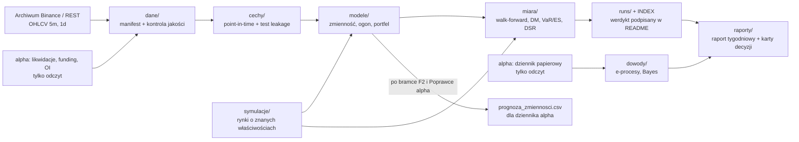

# PRD — program `beta` (roboczo `alpha-ml`): modele matematyczne i uczenie maszynowe na perpetualach krypto

| | |
|---|---|
| Wersja | **0.1 — szkic do decyzji użytkownika** |
| Data | 2026-09-30 |
| Autor | Claude (na polecenie użytkownika); decyzje: użytkownik |
| Gałąź robocza | `claude/hopeful-darwin-qvgutd` (repo `alpha`) |
| Źródła | `runs/INDEX.md` (wnioski 1–111), `docs/rag/01–13`, `docs/mapa_hipotez_2026-10.md`, skille `clas5-quant` i `quant-strategy-catalog` |
| Status | Nic z tego dokumentu nie jest jeszcze uruchomione. **D1 i D5 rozstrzygnięte 2026-09-30** (osobne repo `beta`); D2 i D4 przyjęte 2026-09-30, D6 („tylko DVOL”) 2026-10-05 — `STATUS.md`; otwarte: D3 — §15 |

---

## 1. Streszczenie dla decydenta (2 minuty)

**Co proponuję.** Nowy program badawczy `alpha-ml` (nazwa robocza), zbudowany na tym samym sposobie
rozumowania co CLAS-5, ale z narzędziami matematycznymi i ML jako głównym warsztatem.

**Najważniejsza rzecz, którą trzeba powiedzieć wprost.** Alpha już sprawdziła „ML przewiduje kierunek
ceny z wykresu”. Wynik: trafność 50,27 % przy n = 7 687 transakcji, czyli rzut monetą z przedziałem
ufności, który nie sięga progu opłacalności (wniosek 12). Dłuższe okno uczenia pogorszyło wynik (WF1,
wniosek 85). ML na rankingu monet jest uczciwy, ale traci ~2/3 mocy wobec prostej reguły (AU2, wniosek 93).
**Nowe repo z „mocniejszym ML” na tych samych świecach trafiłoby w tę samą ścianę.** Mocniejszy model
nie wydobędzie informacji, której w danych nie ma.

**Gdzie matematyka i ML naprawdę mogą pomóc** — i to jest trzon tego PRD:

1. **Przewidywanie tego, co DA SIĘ przewidzieć: zmienności i ryzyka ogona** (nie kierunku). Zmienność
   w krypto „skupia się w czasie” (po dużym ruchu przychodzi kolejny duży ruch). To zjawisko jest dobrze
   udokumentowane i mierzalne na dużej próbie. Zastosowanie: wielkość pozycji, odległość od likwidacji
   przy dźwigni 3×, limity portfela.
2. **Lepsza ocena dowodów z dziennika papierowego** (statystyka sekwencyjna). Pozwala czytać wynik na
   bieżąco bez „oszukiwania” przez wielokrotne zaglądanie.
3. **Matematyka portfela** (podział kapitału między strategie, dźwignia pod kontrolą niepewności).
4. **Laboratorium symulacji** — sztuczne rynki o znanych właściwościach, na których sprawdzamy każdy
   przyrząd, zanim dotknie prawdziwych danych.
5. **Gotowy tor ML na NOWE dane** (likwidacje, Hyperliquid), które dopiero się zbierają. Tylko na nich
   próg dowodu wraca do t 1,96 zamiast t 3,84.

**Czego ten program NIE obiecuje.** Nie obiecuje strategii, która zarobi. Obiecuje lepszy silnik ryzyka,
szybsze i uczciwsze decyzje z dziennika oraz gotowość na nowe dane. Zwroty „rzędu zakładu o kierunek”
(Twój cel, `docs/rag/10`) nadal mogą przyjść tylko z nóg, które przejdą drabinę dowodów (ADR-09).

**Twój czas.** Program jest projektowany tak, żebyś poświęcał ~30 minut tygodniowo: raport tygodniowy
+ karty decyzji. Resztę robi Claude na serwerze z tablicy zadań (§6).

---

## 2. Kontekst — czego nauczyła nas alpha

### 2.1 Mapa wyników (skrót; pełne liczby w `runs/INDEX.md`)

| obszar | wynik | co to znaczy dla `alpha-ml` | wniosek |
|---|---|---|---|
| Kierunek BTC z cech wykresu (5m/1h/4h, XGBoost, 10 cech) | p = 50,27 %, CI [49,15; 51,38], próg 52,69 % | **zamknięte** — dowód braku, nie brak dowodu | 12, 39, 69 |
| Dłuższe okno uczenia (365/730 dni) | p 49,6 % / 48,5 %, oba NEGATYWNE | więcej danych nie ratuje | 85 |
| Analiza techniczna (7 rodzin reguł) | np. formacje świecowe 46,35 % [44,38; 48,31] | **zamknięte** | 48–53, 103–104 |
| Dane spoza wykresu (funding, OI, L/S, VRP, F&G, on-chain) | ślad +0,02…+0,05 %/transakcję < koszt 0,08 % | **zamknięte** na BTC 4h | 90 |
| ML przekrojowy (ranking monet) | 0/40 fałszywych alarmów, ale moc ~1/3 prostej reguły | ML przekrojowe nie startuje na tej historii | 92, 93 |
| Trend tygodniowy top-20 (TS1) | ~+11 %/rok [−4; +26], t 1,43 | **ślad**, w dzienniku od 2026-09-24 | 70, 82, 87 |
| Premia Coinbase → BTC (CP1) | +32 %/rok [+2; +62], t 2,09, ale DSR 0,52 | **ślad**, w dzienniku | 72, 96 |
| Momentum przekrojowe (X1) | +9,5 %/rok, t 0,61 (średnia 7 faz) | **ślad słaby**, dziennik osobno | 89 |
| Carry z hedgem (COIN-M) | ~+9 %/rok | działa, ale **poza Twoim celem** | 61 |
| Dźwignia 3× na altach | −3,6 pkt/rok w likwidacjach (2× −1,6) | **ryzyko jest mierzalne i kosztowne** | 76 |

### 2.2 Dwie liczby, które ustawiają cały program

- **Historia 2021–2026 jest wyczerpana jako sędzia.** Po 40 odczytach 41. musi mieć t ≈ 3,84
  (deflated Sharpe, czyli Sharpe skorygowany o liczbę prób), co oznacza roczny Sharpe ~1,6 (wniosek 107).
  Takich przewag nie mają nawet strategie, które naprawdę działają. **Nowe repo NIE zeruje tego licznika**
  — te same dane to ten sam budżet prób (§11.4).
- **Przyrząd na 5,5 roku danych tygodniowych widzi dopiero Sharpe ≥ ~0,86** (połowa przedziału ±31 %/rok;
  wnioski 87, 91). „Nierozstrzygnięte” znaczy tu zwykle „za mało lat”, nie „brak efektu”.

### 2.3 Wniosek dla projektu

Wąskie gardło alpha było **informacyjne, nie inżynieryjne** (wniosek 11). Program ML ma sens tylko wtedy,
gdy zmienia jedną z trzech rzeczy: **target** (co przewidujemy), **zbiór informacyjny** (jakie dane) albo
**sposób użycia dowodów** (jak decydujemy). Wszystkie filary w §7 robią co najmniej jedną z nich.

---

## 3. Trzon rozumowania przeniesiony z alpha

To jest najcenniejsza część alpha — ważniejsza niż kod. Każda reguła ma w nawiasie, skąd ją znamy.
W `alpha-ml` obowiązują od pierwszego commita.

| # | reguła | dlaczego (dowód z alpha) |
|---|---|---|
| R1 | **Mechanizm jednym zdaniem przed danymi.** „Kto traci po drugiej stronie i dlaczego się na to godzi?” | popularność wskaźnika to nie mechanizm (survivorship populacji wskaźników) |
| R2 | **Hipoteza = zbiór informacyjny × formuła × target × horyzont.** Te same pięć pól = ten sam wariant, nawet pod inną nazwą | X1/X2/B3 okazały się jedną rodziną; `bb_pctb_20 ≡ price_zscore_20` |
| R3 | **Rachunek mierzalności PRZED uruchomieniem.** NIEMIERZALNA = runda nie startuje | mapa 007: 6 rodzin zamkniętych bez odczytu, zero zużytego budżetu |
| R4 | **Pre-rejestracja + licznik wariantów + reguła STOP**, zapisane przed obejrzeniem wyniku | zasady 1, 4, 14; „odwrócenie znaku po wyniku” to nowa hipoteza post hoc (49) |
| R5 | **Korekta na liczbę prób (DSR) jest częścią przyrządu** | CP1: t 2,09 → po korekcie DSR 0,52 = rzut monetą (96) |
| R6 | **Walk-forward z purgingiem i embargo; żadnego strojenia na całym zbiorze** | early stopping bez embargo zawyżał p (Z17/Z21) |
| R7 | **Test leakage (przecieku przyszłości) każdej cechy przed modelem** | zasada 2; test opóźnienia sygnału o 1–2 dni jako tani detektor (72) |
| R8 | **Kontrola pozytywna i negatywna każdego silnika** | K1 (widzi znany sygnał), NC1 (nie wymyśla zysku z szumu o grubych ogonach) (79) |
| R9 | **Werdykt ma dwa warunki:** zwrot netto t_neff > 1,96 ORAZ (przy trafności) ci_low(p) > p* | trafność nad progiem przy ujemnym zwrocie = iluzja geometrii wypłaty (W1b, N1; 43) |
| R10 | **N_eff ≤ n zawsze** — korekta na autokorelację tylko odejmuje pewność | A1, Poprawka 2 (50); błąd mianownika N_eff (93, 94) |
| R11 | **Reguły kalendarzowe liczy się jako średnią wszystkich faz startu** | X1 „+42 %” był najlepszym z 7 dni; średnia +9,5 % (89) |
| R12 | **Więcej transakcji ≠ więcej informacji; 20 monet ≠ 20 obserwacji** | korelacja 0,47–0,86 → 20 monet ≈ 2–9 niezależnych zakładów (40, 74, 92) |
| R13 | **Zielony backtest to nie dowód. Rozstrzyga czas (dziennik) i dane spoza próby** | ADR-09 |
| R14 | **Skrypt jest neutralnym reporterem; werdykt podpisuje człowiek/Claude w README** | zasada 12, `classify_checkpoint` to nie kryterium |
| R15 | **LLM nigdy w ścieżce decyzji handlowych** | zasada 6 |
| R16 | **Dane tylko od 2021-01-01; filtr w jednym miejscu konfiguracji** | zasada 20, decyzja użytkownika 2026-09-23 |

**Nowe reguły specyficzne dla ML** (dopisane, bo ML ma własne pułapki):

| # | reguła | dlaczego |
|---|---|---|
| R17 | **Baseline jest zawsze najprostszym modelem** (średnia krocząca, HAR, reguła jednej cechy). Model złożony wchodzi tylko, gdy bije baseline testem statystycznym na OOS | AU2: ML z przeszukiwaniem przegrał z rankingiem po jednej cesze |
| R18 | **Przeszukiwanie hiperparametrów liczy się do licznika wariantów** (każda konfiguracja = próba) albo odbywa się wyłącznie wewnątrz foldu treningowego z zamrożoną siatką zapisaną w pre-rejestracji | multiple testing |
| R19 | **Model deterministyczny albo z jawnym ziarnem; „stabilność na 10 seedach” nie jest dowodem** | zasada 12 (XGBoost deterministyczny) |
| R20 | **Ważność cech (SHAP, importance) to filtr, nie dowód** | skill `clas5-quant` §A.5 |
| R21 | **Deep learning dopiero, gdy prostszy model przejdzie bramkę i zabraknie mu pojemności** — nie „bo modny” | koszt, nieprzejrzystość, łatwe przeuczenie na małym N_eff |

---

## 4. Problem i cel programu

### 4.1 Problem

1. Alpha ma dwa ślady przewagi w dzienniku (TS1, CP1), ale **silnik ryzyka jest prosty**: zmienność
   liczona z okna wstecz, stała dźwignia, płaski model likwidacji. Przy dźwigni 3× to kosztuje realne
   pieniądze (LQ1: −3,6 pkt/rok na altach).
2. **Decyzja z dziennika jest wolna.** Odczyty po 3, 6 i 12 miesiącach z progiem z = 2,31. Brakuje
   narzędzia, które mówi „ile dowodu mamy dziś” bez podnoszenia ryzyka fałszywego alarmu.
3. **Nowe dane się zbierają** (likwidacje Bybit od 2026-09-27, Binance próbka od 2026-09-25, Hyperliquid
   w sondzie), ale nie ma gotowego toru: cechy point-in-time → test przecieku → model → ocena.
4. **Brak laboratorium** — kontrola pozytywna/negatywna jest robiona ad hoc w poszczególnych rundach.

### 4.2 Cele (mierzalne)

| ID | cel | miara sukcesu |
|---|---|---|
| G1 | Prognoza zmienności lepsza niż obecna (okno wstecz) | test Diebolda–Mariano na stracie QLIKE, OOS, istotny w ≥ 80 % monet top-20, żadna moneta istotnie gorsza (§10.4) |
| G2 | Prognoza ryzyka ogona (VaR/ES) przechodząca testy wsteczne | test Kupca i Christoffersena nie odrzuca na 1 % i 5 %; test ES Acerbiego–Szekelya nie odrzuca |
| G3 | Sekwencyjna ocena dziennika | na symulacjach: fałszywy alarm ≤ 5 % przy dowolnie częstym zaglądaniu; moc ≥ moc obecnych 3 odczytów |
| G4 | Laboratorium symulacji | każdy przyrząd programu ma kontrolę pozytywną i negatywną w CI; 0 wyjątków |
| G5 | Tor ML na nowe dane | cechy likwidacyjne point-in-time z testem leakage gotowe przed pierwszym odczytem E1 (najwcześniej 2027-09) |
| G6 | Czas użytkownika | ≤ 30 min/tydzień średnio w kwartale (raport + karty decyzji) |

### 4.3 Niecele (świadomie poza zakresem)

- **Przewidywanie kierunku ceny z cech OHLCV** (dowolnym modelem: boosting, sieci, transformery, RL)
  na historii 2021–2026. Zamknięte w alpha; powrót tylko z nowym zbiorem informacyjnym.
- Grid search po kombinacjach cech, optymalizacja pod Sharpe/CAGR na całej historii.
- Strategie carry/przepływowe jako cel (decyzja użytkownika 2026-09-23).
- LLM w ścieżce decyzji. LLM tylko offline: streszczenia, przegląd kodu, porządkowanie literatury.
- Realny kapitał bez decyzji użytkownika (szczebel 4 ADR-09).
- Handel wysokiej częstotliwości / market making (koszty i infrastruktura poza zasięgiem; Faza 0: próg
  opłacalności na 5m 82,8 %).
- Zmiana kodu, z którego korzysta dziennik papierowy alpha, bez Poprawki i decyzji użytkownika.

---

## 5. Użytkownik i sposób korzystania

**Persona.** Jedna osoba z etatem, z wiedzą quant (wycena opcji, GARCH, VaR/ES, portfel), bez czasu na
codzienną pracę przy kodzie. Handluje perpetualami, long/short, dźwignia 3× na części kapitału.

**Czego potrzebuje:**
1. Raz w tygodniu jedna strona: co się zmieniło, jakie liczby, co z nich wynika, jakie decyzje czekają.
2. Karty decyzji: pytanie, opcje, rekomendacja, ścieżka odwrotu — do odpowiedzi w 5 minut.
3. Pewność, że system nie „wymyśla” zysku (kontrole, liczniki, pre-rejestracje).
4. Na później: prognoza zmienności i ryzyka do własnych pozycji ręcznych (skill `zarzadzanie-pozycja`).

---

## 6. Tryb pracy (jak to ma działać, żeby nie zabierało życia)

| kto | co | kiedy |
|---|---|---|
| Claude na serwerze | bierze zadania z `zadania/` (jak w alpha, zasada 21), pisze kod, testy, rundy, raporty | ciągle, w sesjach |
| Automat | pobiera dane, liczy prognozy zmienności/ES na dziś, generuje raport tygodniowy | codziennie / w niedzielę |
| Użytkownik | czyta raport, odpowiada na karty decyzji | ~30 min/tydzień |
| Użytkownik | decyzje bramkowe: przejście etapu, jakikolwiek kapitał, usuwanie danych | przy bramkach |

Raport tygodniowy (FR-40) jest jedynym „ekranem”, na który trzeba patrzeć.

---

## 7. Filary programu

Każdy filar ma pięć pól z §3 R2, mechanizm, przyrząd i szkic rachunku mocy. Kolejność = rekomendowany
priorytet.

### F0. Wspólny przyrząd (`miara`) — fundament

- **Co:** port kanonicznego pomiaru z alpha: `metrics.py` (mierzalność, Wald, break-even), `checkpoint_lib`
  (t, t_neff, N_eff ≤ n, fold-jitter), `dsr.py` (korekta na liczbę prób), `negative_control.py`.
- **Wymóg:** testy parytetu — te same wektory wejściowe dają w `alpha-ml` te same liczby co w alpha
  (do 1e-12). Bez tego wyniki obu repo nie są porównywalne.
- **Dodatki:** przyrządy dla nowych targetów (§10): Diebold–Mariano z HAC (Newey–West), testy VaR/ES,
  rank IC z szerokością efektywną, PBO (prawdopodobieństwo przeuczenia wyboru, Bailey i in. 2014).

### F1. Laboratorium symulacji (`symulacje`)

- **Target:** żaden rynek — to kalibracja przyrządów.
- **Mechanizm:** jeśli przyrząd nie widzi sygnału, który sami wstawiliśmy, nie zobaczy prawdziwego;
  jeśli widzi sygnał w czystym szumie, kłamie.
- **Generatory:** GBM (baseline), GARCH(1,1) z rozkładem t (skupianie zmienności, grube ogony),
  Heston (zmienność stochastyczna), Merton (skoki), przełączanie reżimów Markowa (Hamilton 1989),
  bootstrap blokowy stacjonarny na prawdziwych zwrotach (zachowuje autokorelację), czynnik rynkowy
  dla koszyka (korelacja 0,47–0,86 jak w danych).
- **Wyjście:** (a) kontrola pozytywna/negatywna dla każdego przyrządu programu; (b) **rachunek mocy
  przez symulację** tam, gdzie wzór analityczny nie istnieje (np. DM test przy autokorelacji straty);
  (c) sztuczne dzienniki do testu metod sekwencyjnych (F3).
- **Kalibracja generatorów** tylko do momentów rozkładu (zmienność, kurtoza, autokorelacja kwadratów)
  — nigdy do średniego zwrotu, żeby nie wbudować przewagi.

### F2. Zmienność i ryzyko ogona (`modele/zmiennosc`, `modele/ogon`) — główny filar ML

- **Info:** OHLCV własne (5m do zmienności zrealizowanej) + opcjonalnie DVOL (Deribit) i funding.
- **Formuła:** jednoaktywowa, osobno per moneta; ocena zbiorcza po monetach z korektą na korelację.
- **Target:** zmienność zrealizowana dnia/tygodnia następnego (log RV), kwantyle zwrotu (VaR 1 %/5 %),
  Expected Shortfall. **Nie kierunek.**
- **Horyzont:** 1 dzień i 7 dni (zgodny z nogami dziennika).
- **Mechanizm:** skupianie zmienności (heterogeniczni uczestnicy działający w różnych horyzontach — model
  HAR, Corsi 2009; efekt GARCH, Bollerslev 1986). Mechanizm poza naszymi danymi: udokumentowany od
  dekad na akcjach, walutach, surowcach → szczebel 1 ADR-09 ma tu mocne oparcie.
- **Drabina modeli (R17, jeden na raz):**
  1. baseline: odchylenie standardowe z okna wstecz — **dokładnie to, czego dziś używa dziennik**;
  2. EWMA (RiskMetrics);
  3. GARCH(1,1)-t, GJR-GARCH (asymetria: spadki podnoszą zmienność bardziej niż wzrosty);
  4. HAR-RV z RV z danych 5m (dzień / tydzień / miesiąc);
  5. HAR-RV + zmienne zewnętrzne (funding, DVOL, OI) — każda osobno, R4;
  6. gradient boosting (LightGBM/XGBoost) na cechach HAR — tylko jeśli 4–5 przejdą bramkę;
  7. kwantylowy boosting / regresja kwantylowa i EVT (teoria wartości ekstremalnych, ogon GPD) dla VaR/ES.
- **Przyrząd:** strata QLIKE (odporna na szum w RV — Patton 2011) i MSE na log RV; test DM parami
  z HAC; dla VaR/ES testy z §10.4.
- **Szkic mierzalności (do potwierdzenia w F1):** ~2 100 dni OOS na monetę. Jeśli różnica strat ma
  stosunek średnia/odchylenie ≈ 0,1, a autokorelacja zmniejsza próbę do ~700 dni efektywnych, to
  t ≈ 0,1 × √700 ≈ 2,6. Literatura na innych rynkach pokazuje przewagę HAR nad oknem wstecz tej skali —
  ale to **założenie**, które F1 musi sprawdzić, zanim runda wystartuje (R3).
- **Zastosowanie (dopiero po bramce):** celowanie w zmienność (vol targeting) nóg dziennika, odległość
  od ceny likwidacji przy 3×, limit portfela na ES. **Uwaga:** lepsza prognoza zmienności nie tworzy
  przewagi — skaluje tę, która jest. Na strategii bez przewagi daje zero. Dlatego wartość ekonomiczną
  mierzymy **prospektywnie w dzienniku**, nie kolejnym odczytem historii (§11.4). Literatura o wartości
  „vol-managed portfolios” jest mieszana (Moreira–Muir 2017 za; Cederburg i in. 2020 — poza próbą słabiej).
- **Co da się zmierzyć od razu na historii bez zużycia budżetu zwrotów:** liczba likwidacji i ES nóg przy
  prognozie A vs B (to ryzyko, nie zwrot — osobny licznik, §11.4).

### F3. Sekwencyjna ocena dowodów (`dowody`)

- **Target:** decyzja „utrzymać / obalić” nogę dziennika.
- **Mechanizm (statystyczny):** klasyczny test zakłada jeden odczyt w ustalonym momencie. Zaglądanie
  co tydzień z progiem 1,96 zawyża fałszywe alarmy. Metody „zawsze ważne” (e-wartości, mieszany SPRT —
  Johari i in. 2017; Ramdas, Grünwald i in. 2023) pozwalają patrzeć codziennie bez tej kary.
- **Wyjście:** (a) e-proces „czy średni zwrot nogi < założony minus margines” (obalenie) i „czy > 0”
  (potwierdzenie); (b) bayesowski rozkład a posteriori średniego zwrotu z priorem **z ADR-09**
  (np. ślad z historii ściągnięty mocno do zera — DSR 0,52 to słaby prior); (c) wykres ścieżki dowodu.
- **Status wobec ADR-09:** kryteria szczebla 3 są zapisane z góry (z = 2,31 na odczytach 92/182/365 dni).
  F3 **dochodzi jako drugi reporter**, nie zastępuje kryterium. Zmiana kryterium = decyzja użytkownika,
  zapisana **przed** odczytem 2026-12-24 (inaczej post hoc). Patrz D3 w §15.
- **Bramka:** na symulacjach F1 fałszywy alarm ≤ 5 % przy codziennym zaglądaniu przez 365 dni; moc przy
  prawdziwym +15 %/rok nie mniejsza niż trzech odczytów z = 2,31.

### F4. Portfel i wielkość pozycji (`modele/portfel`)

- **Target:** wagi nóg i dźwignia portfela.
- **Metody:** ERC (równy udział w ryzyku), HRP (hierarchiczny podział ryzyka — López de Prado 2016),
  minimalizacja CVaR z ograniczeniami (limit depozytu, limit na monetę), ułamkowy Kelly z niepewnością
  estymacji przewagi (Kelly liczony na dolnym krańcu przedziału, nie na punkcie), Black–Litterman
  z „widokami” = rozkłady a posteriori z F3.
- **Ograniczenie z alpha:** przy 2 nogach ERC = 1/σ, więc różnica zaczyna się od trzeciej niezależnej
  nogi (PR1, wniosek 101). **F4 buduje narzędzie teraz, a używa go, gdy pojawi się noga o korelacji
  ≤ ~0,35 do obecnych.** Do tego czasu jedyne zastosowanie: prognozy F2 w miejsce σ z okna wstecz.
- **Zasada 5 zostaje:** sufit dźwigni wygrywa z każdym sizingiem — jawne `min()`.

### F5. Tor ML na nowe dane (`dane/nowe`, `cechy`)

- **Info:** likwidacje (Bybit pełne od 2026-09-27, Binance próbka od 2026-09-25), Hyperliquid
  (funding, premia, docelowo likwidacje — decyzja użytkownika), migawki arkusza zleceń (opcjonalnie).
- **Dlaczego to ma sens:** to jedyny obszar, gdzie licznik prób jest świeży (próg t 1,96 zamiast 3,84 —
  mapa 007 §1) i gdzie zbiór informacyjny jest naprawdę inny niż OHLCV.
- **Co budujemy teraz:** magazyn cech point-in-time (każda wartość ze znacznikiem „kiedy była znana”),
  testy przecieku, testy kompletności strumienia (kontrola pozytywna źródła: kanał, który na pewno nadaje —
  wnioski 102, 106), rachunek mocy z bieżącą długością historii.
- **Czego nie robimy:** żadnego odczytu, dopóki rachunek mocy nie da MIERZALNA (dla E1 najwcześniej
  2027-09). Wcześniej tylko opis danych.
- **Kandydaci na target:** kierunek po kaskadzie likwidacji (E1), zmienność po kaskadzie (łączy się z F2
  — **to może być najszybciej mierzalny target**, bo zmienność ma dużo większy stosunek sygnału do szumu
  niż kierunek).

### F6. Warstwa ML nad sygnałem (meta-labeling) — warunkowa

- **Co:** model, który nie wybiera kierunku, tylko decyduje „bierz / pomiń / pół pozycji” dla sygnału
  nogi, która już przeszła szczebel 3 (López de Prado 2018, rozdz. 3).
- **Warunek startu:** noga po szczeblu 3 ADR-09 + ≥ 1 cecha spoza OHLCV z testem leakage + mierzalność.
- **Ocena tylko prospektywna** (nowy dziennik obok), bo odczyt na historii to 41. próba.
- **Priorytet: najniższy.** Największe ryzyko przeuczenia w całym programie.

### F7. Reżimy jako opis, nie bramka

- HMM (ukryty model Markowa), bayesowskie wykrywanie punktów zmiany (Adams–MacKay 2007) — do **opisu**
  i do F2 (zmienność warunkowa od reżimu), **nie** jako bramka wejścia. W alpha bramka reżimu zagłodziła
  próbę do 0,53 % świec (wnioski 12, 20). Użycie jako bramki = osobna hipoteza z pre-rejestracją.

---

## 8. Wymagania funkcjonalne

### Dane

| ID | wymaganie |
|---|---|
| FR-01 | Pobieranie OHLCV 5m i 1d dla uniwersum top-20 i top-50 point-in-time (z delistowanymi), od 2021-01-01, z archiwum plików Binance (`data.binance.vision`) i REST. |
| FR-02 | Manifest danych: każdy plik z hashem SHA-256, zakresem dat, źródłem i wersją skryptu. Każda runda cytuje hash manifestu. |
| FR-03 | Kontrola jakości: dziury, duplikaty, świece zerowe, skoki > k·σ — raport, nigdy ciche poprawianie. |
| FR-04 | Filtr `min_start` w jednym miejscu (`config/settings.yaml`), nakładany przez jedną funkcję ładującą. |
| FR-05 | Uniwersum koszyka z pliku kompletnego (lekcja RU1: obcięte uniwersum przeszło przez ~10 rund). |
| FR-06 | Odczyt danych alpha (likwidacje, funding, OI) tylko do odczytu — bez zapisu do repo alpha. |

### Cechy i przeciek

| ID | wymaganie |
|---|---|
| FR-10 | Każda cecha = czysta funkcja `compute_<nazwa>(df) -> pd.Series`, okna tylko wstecz. |
| FR-11 | Test przecieku (przesunięcie w przód, zasada 2) automatycznie dla każdej cechy w rejestrze; cecha bez testu nie trafia do modelu. |
| FR-12 | Test masy punktowej (progi percentylowe zakazane przy masie > 20 % — funding 35,85 %, wniosek 15). |
| FR-13 | Rejestr cech (`cechy/rejestr.yaml`): nazwa, zbiór informacyjny, opóźnienie publikacji, data dodania, runda, która ją zmierzyła. |

### Modele

| ID | wymaganie |
|---|---|
| FR-20 | Wspólny interfejs prognozy: `fit(train) -> model`, `predict(model, stan_na_t) -> prognoza`; brak dostępu do danych po t (wymuszone testem). |
| FR-21 | Modele F2: okno wstecz, EWMA, GARCH(1,1)-t, GJR-GARCH, HAR-RV, HAR-X, boosting na cechach HAR, regresja kwantylowa, EVT-GPD. |
| FR-22 | Rejestr modeli w plikach (`modele/rejestr.yaml` + katalog rundy): parametry, hash danych, hash kodu, ziarno. Bez zewnętrznego serwera (MLflow niepotrzebny na tę skalę). |
| FR-23 | Hiperparametry wyłącznie wewnątrz foldu treningowego, siatka zamrożona w pre-rejestracji (R18). |

### Walidacja i przyrząd

| ID | wymaganie |
|---|---|
| FR-30 | Walk-forward z purgingiem i embargo (długość embarga ≥ horyzont targetu). |
| FR-31 | CPCV (kombinatoryczna walidacja krzyżowa z purgingiem, López de Prado 2018) do oceny rozrzutu wyniku i PBO; końcowy werdykt zawsze z walk-forward. |
| FR-32 | Przyrządy: DM z HAC; Kupiec (pokrycie), Christoffersen (niezależność przekroczeń), test ES (Acerbi–Szekely 2014); rank IC + szerokość efektywna; t_neff, N_eff ≤ n, DSR. |
| FR-33 | `measurability_report` rozszerzony o targety ciągłe: minimalny wykrywalny efekt dla różnicy strat przy danym n i autokorelacji — analitycznie albo symulacją F1. |
| FR-34 | Rejestr odczytów wspólny z alpha (`odczyty_historii.csv`) — każdy odczyt zwrotu na historii 2021–2026 z obu repo podbija ten sam licznik (§11.4). |

### Raporty i dziennik

| ID | wymaganie |
|---|---|
| FR-40 | Raport tygodniowy (1 strona, Markdown + opcjonalnie strona HTML): zmiany, kluczowe liczby z tłumaczeniem, stan dowodów F3, karty decyzji. |
| FR-41 | Katalog rundy jak w alpha (zasada 11): README z pre-rejestracją, wynikiem, „Co na plus / na minus”, werdyktem Ready/Caveats/Revision, `raw_output.txt`, artefakty. |
| FR-42 | Codzienna prognoza zmienności i ES dla monet dziennika (po bramce F2) jako plik CSV — **tylko do odczytu** przez alpha; wpięcie do dziennika = Poprawka alpha + decyzja użytkownika. |

---

## 9. Wymagania niefunkcjonalne

| ID | wymaganie |
|---|---|
| NFR-01 | **Odtwarzalność:** `requirements-lock.txt`, Python 3.12, ziarna jawne, hash danych i kodu w każdej rundzie. Ta sama komenda = te same liczby. |
| NFR-02 | **Testy (DoD jak zasada 10):** jednostkowe + leakage + własności (`hypothesis`) + parytet z alpha dla `miara`. Commit bez testów nie jest „zrobiony”. |
| NFR-03 | **Lint/format:** `ruff` + `black`; CI na GitHub Actions (testy + lint na każdym pushu). |
| NFR-04 | **Minimalne zależności:** numpy, pandas, pyarrow, scipy, statsmodels, `arch` (GARCH), scikit-learn, lightgbm lub xgboost, hypothesis, pytest. DuckDB opcjonalnie do zapytań po parquet. Bez PyTorch do czasu R21. |
| NFR-05 | **Wydajność:** pełna runda F2 (20 monet × ~2 100 dni × 7 modeli, walk-forward) ≤ 1 h na serwerze CPU. |
| NFR-06 | **Bezpieczeństwo:** zero kluczy API w repo (lekcja z repo `lessons`); klucze tylko w zmiennych środowiska; program nie składa zleceń. |
| NFR-07 | **Język:** raporty po polsku, prostym językiem (zasada 17); nazwy w kodzie jak w alpha (polskie dla domeny projektu, angielskie dla pojęć technicznych). |
| NFR-08 | **Jedna informacja w jednym miejscu** (jak alpha): `runs/` = wyniki, `runs/INDEX.md` = stan wiedzy, `STATUS.md` = decyzje, `README.md` = widok. |

---

## 10. Architektura

### 10.1 Układ repozytorium

```
alpha-ml/
├── CLAUDE.md               # zasady R1–R21 (CO); odwołania do docs/adr (DLACZEGO)
├── README.md  STATUS.md    # widok + kamienie milowe; decyzje, ryzyka, backlog
├── config/settings.yaml    # min_start, uniwersa, koszty, ścieżki danych alpha (tylko odczyt)
├── miara/                  # F0: port przyrządu alpha + nowe testy (DM, VaR/ES, PBO, CPCV)
│   └── tests/test_parytet_alpha.py
├── dane/                   # FR-01..06: pobieranie, manifest, kontrola jakości, loader point-in-time
├── cechy/                  # FR-10..13: compute_*, rejestr, testy leakage i masy punktowej
├── symulacje/              # F1: generatory, kontrole pozytywne/negatywne, moc przez symulację
├── modele/
│   ├── zmiennosc/          # F2: okno, EWMA, GARCH-t, GJR, HAR, HAR-X, boosting
│   ├── ogon/               # F2: regresja kwantylowa, EVT-GPD, ES
│   ├── portfel/            # F4: ERC, HRP, CVaR, Kelly z niepewnością, Black–Litterman
│   └── rezim/              # F7: HMM, BOCPD (opis)
├── dowody/                 # F3: e-procesy, mSPRT, Bayes; czytnik dziennika alpha
├── raporty/                # FR-40: raport tygodniowy, karty decyzji
├── runs/  runs/INDEX.md    # jak w alpha (zasady 11, 14)
├── zadania/                # tablica zadań (jak alpha, zasada 21)
├── docs/adr/               # decyzje architektoniczne
└── tests/
```

### 10.2 Przepływ danych



### 10.3 Relacja z repo alpha

| sprawa | decyzja w PRD |
|---|---|
| Dziennik papierowy | zostaje w alpha (`alpha-dziennik`, `master`). `alpha-ml` go tylko czyta. |
| Przyrząd | port do `alpha-ml/miara` z testem parytetu; zmiany przyrządu w alpha → ta sama zmiana w `alpha-ml` (lub wydzielenie wspólnego pakietu — D1). |
| Rejestr odczytów | **wspólny** (`odczyty_historii.csv`): nowe repo nie daje nowego budżetu na tych samych danych. |
| Zamrożone skrypty alpha | nietykalne; `alpha-ml` ich nie importuje. |
| Skille | nowe repo używa `clas5-quant` i `quant-strategy-catalog`; docelowo skill `alpha-ml-quant` (nowa wersja w chmurze konta, decyzja użytkownika). |

### 10.4 Metryki według typu targetu

| target | przyrząd | kryterium POZYTYWNE |
|---|---|---|
| kierunek (reguła/model) | p, p*, t_neff zwrotu netto | ci_low(p) > p* ORAZ t_neff > 1,96 (na historii: próg DSR) |
| zmienność | QLIKE, MSE log RV, DM z HAC | DM t > 1,96 na korzyść nowego modelu w ≥ 80 % monet, żadna istotnie gorsza |
| VaR / ES | Kupiec, Christoffersen, Acerbi–Szekely | brak odrzucenia na 5 % przy mierzalnej liczbie przekroczeń |
| ranking monet | rank IC, ICIR, szerokość efektywna | ci_low(IC) > próg IC z kosztów (AU2) |
| portfel | t_neff zwrotu netto, DSR, maks. obsunięcie, ES | tylko prospektywnie (dziennik) |
| dowód z dziennika | e-proces, a posteriori | e-wartość ≥ 20 (odpowiednik α 5 %) — jako reporter obok ADR-09 |

---

## 11. Metodologia — szczegóły obowiązkowe

### 11.1 Walidacja
Walk-forward z oknem kroczącym, purging (usunięcie z treningu obserwacji, których target nachodzi na
test) i embargo ≥ horyzont targetu. CPCV tylko do rozrzutu i PBO, nigdy jako jedyny werdykt.

### 11.2 Pre-rejestracja
Szablon karty jak `quant-strategy-catalog/scripts/hypothesis_card.py`, rozszerzony o: target ciągły,
przyrząd, baseline, siatkę hiperparametrów (zamrożoną), rachunek mocy z F1, licznik.

### 11.3 Mierzalność (zasada 18 dla targetów ciągłych)
Przed rundą: minimalny wykrywalny efekt dla danego n i autokorelacji straty. Jeśli zakładany efekt
z literatury < MDE → NIEMIERZALNA, runda nie startuje.

### 11.4 Liczniki — co zużywa budżet historii, a co nie

| pytanie | licznik | próg |
|---|---|---|
| czy strategia X zarabia na 2021–2026 (zwrot) | **wspólny rejestr alpha** (dziś N = 40) | DSR: t ≈ 3,84 |
| czy model zmienności A prognozuje lepiej niż B | nowy licznik „zmienność 2021+” | t 1,96 + korekta Holma na liczbę par modeli |
| czy VaR/ES przechodzi testy wsteczne | nowy licznik „ryzyko 2021+” | testy z §10.4 |
| czy sygnał na nowych danych (likwidacje, HL) działa | nowy licznik per źródło | t 1,96 (mapa 007 §1) |
| czy prognoza F2 poprawia wynik nogi dziennika | **dziennik prospektywny** | ADR-09 szczebel 3 |

Uzasadnienie: pytanie o prognozę zmienności to inna hipoteza niż pytanie o zwrot; ale każde użycie
prognozy do policzenia **zwrotu** strategii na historii to kolejny odczyt tej samej historii.

---

## 12. Plan etapów

Zakładam pracę Claude na serwerze w trybie tablicy zadań i ~30 min/tydzień użytkownika. Terminy są
orientacyjne; bramka przejścia = decyzja użytkownika.

| etap | zakres | wynik / Definition of Done | bramka | orientacyjnie |
|---|---|---|---|---|
| **E0 — Fundament** | repo, CLAUDE.md (R1–R21), CI, `miara` z parytetem, manifest danych, loader z `min_start` | testy parytetu zielone; kontrola negatywna NC1 odtworzona w nowym repo | użytkownik: „E0 zamknięty” | tydz. 1–2 |
| **E1 — Laboratorium** | generatory F1, kontrole dla przyrządów F2/F3, rachunek mocy przez symulację | raport mierzalności dla G1–G3; decyzja, które rundy F2 są MIERZALNE | jeśli G1 NIEMIERZALNE → F2 skraca się do ES/likwidacji | tydz. 2–4 |
| **E2 — Zmienność i ogon** | dane 5m top-20, drabina modeli F2 (jeden na raz), testy VaR/ES | runda F2-1: HAR-RV vs okno wstecz; kolejne tylko przy wyniku pozytywnym | G1, G2 | tydz. 4–8 |
| **E3 — Dowody sekwencyjne** | e-proces + Bayes na dzienniku alpha (tylko odczyt), symulacje fałszywych alarmów | reporter gotowy **przed 2026-12-24**; karta decyzji D3 | G3 | równolegle z E2, do 2026-12-15 |
| **E4 — Portfel** | ERC/HRP/CVaR/Kelly z niepewnością na prognozach F2 | narzędzie + opis; wpięcie do dziennika = Poprawka alpha | trzecia niezależna noga albo decyzja o F2 w dzienniku | po E2 |
| **E5 — Nowe dane** | magazyn cech point-in-time dla likwidacji/HL, rachunek mocy co kwartał | pierwszy odczyt tylko przy MIERZALNA (E1 ~2027-09) | G5 | od E2, ciągle |
| **E6 — Meta-labeling** | F6 | tylko dla nogi po szczeblu 3 | decyzja użytkownika | 2027+ |

**Pierwsze 3 zadania na tablicę `alpha-ml`** (po akceptacji PRD):
1. `001-repo-i-miara` — utworzenie repo, port `miara`, testy parytetu, CI.
2. `002-dane-5m-top20` — pobranie i manifest 5m od 2021-01-01, raport jakości.
3. `003-laboratorium-moc-f2` — generator GARCH-t + bootstrap blokowy, MDE dla testu DM na QLIKE.

---

## 13. Metryki programu (po czym poznamy, że program działa)

| metryka | cel |
|---|---|
| Rundy uruchomione bez rachunku mierzalności | 0 |
| Przyrządy bez kontroli pozytywnej i negatywnej | 0 |
| Cechy w modelach bez testu leakage | 0 |
| Odczyty historii zwrotów poza wspólnym rejestrem | 0 |
| Czas użytkownika | ≤ 30 min/tydzień |
| Raport tygodniowy dostarczony | ≥ 90 % tygodni |
| Wynik G1/G2 | rozstrzygnięty (pozytywny ALBO negatywny z mocą) do końca E2 |

Uwaga: **wynik negatywny z wystarczającą mocą jest sukcesem przyrządu**, tak jak zamknięcie Fazy 0.

---

## 14. Ryzyka

| ryzyko | skutek | mitygacja |
|---|---|---|
| Oczekiwanie „ML znajdzie to, czego statystyka nie znalazła” | lata pracy nad tą samą ścianą | §4.3 niecele; R17; wnioski 11, 85, 93 w CLAUDE.md nowego repo |
| Nowe repo jako „świeży start” licznika | fałszywe pozytywy | wspólny rejestr odczytów (FR-34), §11.4 |
| Przeciek w cechach 5m (np. RV liczona z niepełnego dnia) | zawyżona trafność prognozy | FR-11, test „stan na t”, embargo |
| Lepsza zmienność bez przewagi w nogach | zero wartości ekonomicznej | jasno opisane w F2; ocena w dzienniku |
| Rozjazd przyrządu alpha vs `alpha-ml` | nieporównywalne liczby | testy parytetu; D1 (wspólny pakiet) |
| Złożoność (za dużo modeli naraz) | brak wyników, wypalenie | jeden model na raz, drabina F2, bramki etapów |
| Zmiana kryterium ADR-09 po obejrzeniu dziennika | post hoc | F3 jako reporter; D3 przed 2026-12-24 |
| Czas użytkownika rośnie | projekt „zjada życie” | G6 mierzony; karty decyzji ≤ 5 min |
| Koszt tokenów sesji | przerwy w pracy | wytyczne `docs/rag/12`: nowa sesja na zadanie, agenci pomocniczy do prac mechanicznych |

---

## 15. Decyzje dla użytkownika

| ID | pytanie | opcje | rekomendacja |
|---|---|---|---|
| D1 ✅ | Gdzie mieszka program? **Decyzja użytkownika 2026-09-30: „osobne repo”.** | (a) nowe repo `alpha-ml` z portem `miara`; (b) katalog `ml/` w alpha; (c) nowe repo + wspólny pakiet `miara` importowany przez oba | **(a) teraz, (c) po E2** — nowe repo nie dotyka dziennika ani zamrożonych skryptów; wspólny pakiet, gdy przyrząd się ustabilizuje |
| D2 | Kolejność filarów | F0 → F1 → F2 → F3 → F4 → F5 → F6 | **tak, z F3 równolegle do F2** (termin 2026-12-24) |
| D3 | Rola F3 wobec ADR-09 | (a) tylko reporter obok z = 2,31; (b) kandydat na kryterium od odczytu 6-miesięcznego | **(a)**; ewentualna zmiana na (b) zapisana przed 2026-12-24 |
| D4 | Dane 5m dla top-20 od 2021 | pobrać (~kilkaset MB parquet) / nie | **pobrać** — bez nich HAR-RV nie ma sensu |
| D5 ✅ | Nazwa i utworzenie repo na GitHubie. **Decyzja użytkownika 2026-09-30: „niech nazywa się beta”** → `piotrgebala/beta`. | `alpha-ml` / inna | do Twojej decyzji; po niej Claude zakłada repo i zadanie 001 |
| D6 | Opcje (Deribit) jako źródło danych dla F2 | DVOL darmowy / pełne opcje płatne | **tylko DVOL**; pełne opcje dopiero, gdy F2 pokaże wartość |

---

## 16. Słownik

- **Target** — to, co model przewiduje (np. zmienność jutro), w odróżnieniu od cech (danych wejściowych).
- **OOS (out-of-sample)** — dane, których model nie widział w treningu.
- **Walk-forward** — trenuj na przeszłości, testuj na następnym kawałku, przesuń okno, powtórz.
- **Purging / embargo** — usunięcie z treningu obserwacji nachodzących czasowo na test, plus przerwa.
- **Przeciek (leakage)** — cecha „wie” coś z przyszłości; daje piękny backtest i zero na żywo.
- **N_eff** — efektywna liczba niezależnych obserwacji po uwzględnieniu autokorelacji; zawsze ≤ n.
- **t_neff** — statystyka t liczona z N_eff zamiast n.
- **DSR (deflated Sharpe ratio)** — Sharpe skorygowany o liczbę wypróbowanych pomysłów.
- **QLIKE** — funkcja straty do oceny prognoz zmienności, odporna na szum w mierzonej zmienności.
- **Test Diebolda–Mariano (DM)** — czy jedna prognoza jest istotnie lepsza od drugiej.
- **VaR / ES** — strata, której nie przekroczymy z prawdopodobieństwem np. 99 % / średnia strata w tym 1 % najgorszych dni.
- **HAR-RV** — model zmienności z trzech składników: wczorajszej, tygodniowej i miesięcznej zmienności zrealizowanej.
- **GARCH** — model, w którym dzisiejsza zmienność zależy od wczorajszego szoku i wczorajszej zmienności.
- **e-wartość / e-proces** — miara dowodu, którą można sprawdzać codziennie bez zawyżania fałszywych alarmów.
- **ERC / HRP** — podział kapitału tak, żeby każda noga wnosiła podobne ryzyko / hierarchicznie po klastrach korelacji.
- **Meta-labeling** — drugi model decyduje, czy wziąć sygnał pierwszego (nie wybiera kierunku).
- **PBO** — prawdopodobieństwo, że wybrany „najlepszy” wariant jest przeuczony.

## 17. Literatura (mechanizmy i przyrządy)

- Bollerslev (1986) — GARCH; Glosten, Jagannathan, Runkle (1993) — GJR-GARCH.
- Corsi (2009) — HAR-RV; Patton (2011) — QLIKE i odporne funkcje straty.
- Diebold, Mariano (1995) — porównanie prognoz; Newey, West (1987) — błędy HAC.
- Kupiec (1995), Christoffersen (1998) — testy VaR; Acerbi, Szekely (2014) — testy ES.
- Hamilton (1989) — przełączanie reżimów; Adams, MacKay (2007) — bayesowskie punkty zmiany.
- Bailey, López de Prado (2014) — DSR; Bailey, Borwein, López de Prado, Zhu (2014) — PBO.
- López de Prado (2016) — HRP; López de Prado (2018) — purging, CPCV, meta-labeling.
- Johari, Pekelis, Walsh (2017) — mSPRT; Ramdas, Grünwald, Vovk, Shafer (2023) — e-wartości.
- Moreira, Muir (2017) — portfele zarządzane zmiennością; Cederburg, O'Doherty, Wang, Yan (2020) — krytyka poza próbą.
- Black, Litterman (1992); Maillard, Roncalli, Teïletche (2010) — ERC.
- Moskowitz, Ooi, Pedersen (2012) — trend (mechanizm TS1).

---

## Aneks A. Skąd pochodzi każda liczba z §2

`runs/INDEX.md` → „Stan wiedzy — skrót” i „Wnioski skumulowane” (numery w tabelach), `docs/rag/09`
(drabina dowodów), `docs/mapa_hipotez_2026-10.md` §1 (progi t 1,96 / 3,84), README runów WF1, AU2, LQ1,
PR1. Liczby przepisane, nie przeliczone ponownie — to PRD, nie runda (nie zużywa licznika).

## Aneks B. Użyte skille

- `clas5-quant` — źródło trzonu rozumowania (§3), kolejność diagnozy i warunki werdyktu.
- `quant-strategy-catalog` — statusy rodzin (§2.1, §4.3), filtr (a)–(f), ranking po mapie 007.
- `engineering:architecture` (zasada 19, decyzja architektoniczna) — **niedostępny w sesji**; architektura
  (§10) jest propozycją PRD, a ADR powstanie w nowym repo po decyzji D1.
